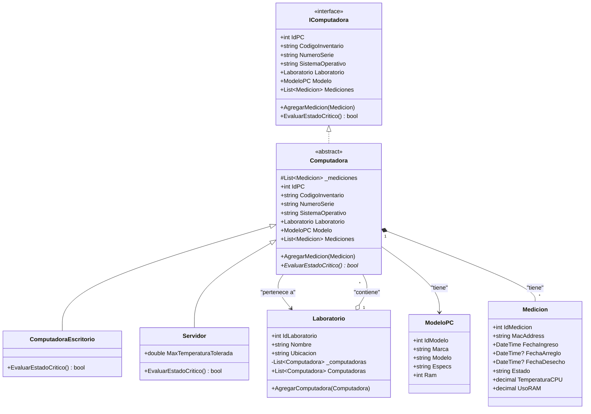

```mermaid
classDiagram

%% Interfaces e implementaciones
class IComputadora {
    <<interface>>
    +int IdPC
    +string CodigoInventario
    +string NumeroSerie
    +string SistemaOperativo
    +Laboratorio Laboratorio
    +ModeloPC Modelo
    +List~Medicion~ Mediciones
    +AgregarMedicion(Medicion)
    +EvaluarEstadoCritico() bool
}

class Computadora {
    <<abstract>>
    #List~Medicion~ _mediciones
    +int IdPC
    +string CodigoInventario
    +string NumeroSerie
    +string SistemaOperativo
    +Laboratorio Laboratorio
    +ModeloPC Modelo
    +List~Medicion~ Mediciones
    +AgregarMedicion(Medicion)
    +EvaluarEstadoCritico()* bool
}

class ComputadoraEscritorio {
    +EvaluarEstadoCritico() bool
}

class Servidor {
    +double MaxTemperaturaTolerada
    +EvaluarEstadoCritico() bool
}

%% Otras Entidades
class ModeloPC {
    +int IdModelo
    +string Marca
    +string Modelo
    +string Especs
    +int Ram
}

class Medicion {
    +int IdMedicion
    +string MacAddress
    +DateTime FechaIngreso
    +DateTime? FechaArreglo
    +DateTime? FechaDesecho
    +string Estado
    +decimal TemperaturaCPU
    +decimal UsoRAM
}

class Laboratorio {
    +int IdLaboratorio
    +string Nombre
    +string Ubicacion
    -List~Computadora~ _computadoras
    +List~Computadora~ Computadoras
    +AgregarComputadora(Computadora)
}

%% Relaciones
IComputadora <|.. Computadora
Computadora <|-- ComputadoraEscritorio
Computadora <|-- Servidor

Computadora --> Laboratorio : "pertenece a"
Computadora --> ModeloPC : "tiene"
Computadora "1" *-- "*" Medicion : "tiene"
Laboratorio "1" o-- "*" Computadora : "contiene"
```