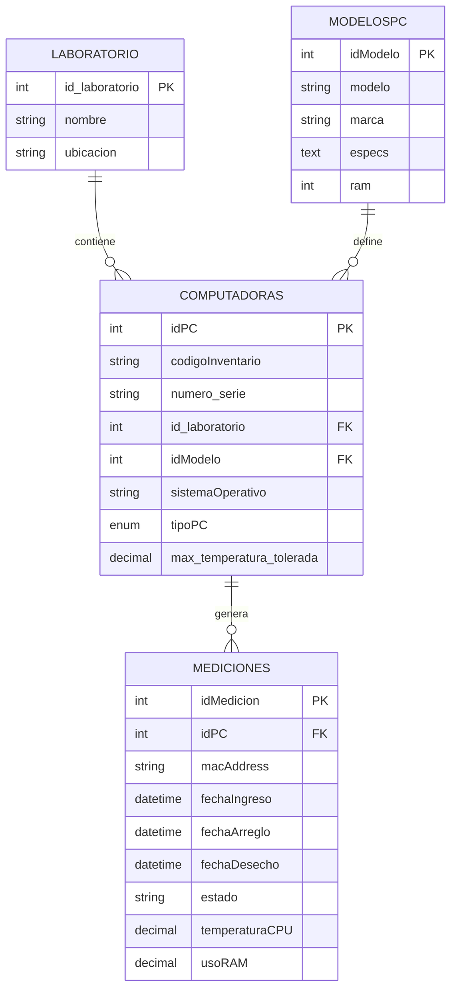

```mermaid
erDiagram

LABORATORIO ||--o{ COMPUTADORAS : "contiene"
MODELOSPC ||--o{ COMPUTADORAS : "define"
COMPUTADORAS ||--o{ MEDICIONES : "genera"

LABORATORIO {
    int id_laboratorio PK
    string nombre
    string ubicacion
}

MODELOSPC {
    int idModelo PK
    string modelo
    string marca
    text especs
    int ram
}

COMPUTADORAS {
    int idPC PK
    string codigoInventario
    string numero_serie
    int id_laboratorio FK
    int idModelo FK
    string sistemaOperativo
    enum tipoPC
    decimal max_temperatura_tolerada
}

MEDICIONES {
    int idMedicion PK
    int idPC FK
    string macAddress
    datetime fechaIngreso
    datetime fechaArreglo
    datetime fechaDesecho
    string estado
    decimal temperaturaCPU
    decimal usoRAM
}
```